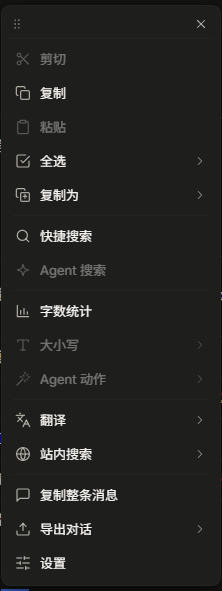

# dsh-desktop-context-menu

<p align="center">
  
</p>

**专为Deepseek Harness 桌面端开发的**右键实用工具菜单插件：页面任意位置选中文本后右键，弹出**常用实用工具菜单**（可配置替换原生菜单或同时显示），并提供可驻留的浮动工具条与居中可拖拽的设置模态。

## 功能

- **编辑**：剪切 / 复制 / 粘贴 / **全选**（一级按钮点击即执行，默认 = 当前消息；hover 展开二级菜单：当前消息 / 本轮对话 / 所有消息）· **复制为**（Markdown 引用 / 纯文本 / 无序列表 / 代码块 / 行内代码）
- **搜索**：快捷搜索（Bing / 百度 / Google / DuckDuckGo / 自定义 URL）+ Agent 搜索（路由到会话输入框，可配置自动发送）
- **Agent 快捷动作**：解释 / 总结 / 翻译中英 / 润色改写 / 找 Bug（找 Bug 为代码专用，选中代码时出现）
- **文本工具**：字数统计 · 大小写转换（AA / aa / Aa）
- **翻译 / 站点搜索**：Google 翻译 · DeepL（复制到剪贴板 + 打开翻译器，弹窗提醒粘贴）· 站点搜索（Wikipedia / Stack Overflow / GitHub / MDN / Google / Bing / 掘金 / CSDN / V2EX / Hugging Face / arXiv，均带 hover 说明）
- **复制整条消息**（无选中时禁用）· **导出对话**（Markdown / JSON / PDF 打印另存，自动展开分页历史并剔除工具调用/思考块等元数据）
- **设置**：居中可拖拽模态，五个分组卡片，分段控制 + 开关，所有项即时保存（详见下方「设置」）
- **剪贴板兜底**：与系统剪贴板双向同步（页面内复制/剪切、任何 `clipboard.writeText` 调用、窗口聚焦时尽力读取），外部复制的内容右键粘贴可用

## 主题与视觉

> **建议与 [dsh-claude-style](https://github.com/Nwflower/dsh-claude-style) 一并使用，以获得最佳的视觉体验。**

- 视觉层按 [dsh-claude-style](https://github.com/Nwflower/dsh-claude-style) 皮肤的弹层规范构建：**12px 卡片圆角、1px 发丝线边框、6px 内边距、32px 行高（6px 行圆角）、中性 hover wash、单一强调色、0.15s 一次性入场动画**（尊重 `prefers-reduced-motion`）
- **16px 内联线性 SVG 图标**（stroke 跟随 `currentColor`），大小写转换项使用等宽字体字形，明暗自动适配
- **两级配色解析**（随宿主 `body[data-ds-dark-theme]` 标记自动切明暗）：
  - 装了 dsh-claude-style → 跟随皮肤变量：Claude 象牙/暗色卡片 + clay `#d97757` 强调色
  - 未装皮肤 → 内置固定调色板：亮色白卡片；暗色黑灰卡片（`#202124`）+ DeepSeek 蓝 `#4d6bfe` 强调色，发丝线与阴影可见（不经过宿主灰阶 alias，观感稳定）

**纯客户端 DOM 实现**（`inject: []`，零 React/内部结构依赖），随 DSH 应用更新**不会丢失**——插件只活在用户 profile（`~/.dsh`）与浏览器 localStorage，不修改应用安装目录。已对照 **DSH `0.2.0-rc.2`** 逐一核实：`window.__ModuleLoader__.load` 注册机制与全部 DOM 锚点（`data-chat-flow-kind`、`data-turn-tail`、`textarea[data-phase]`、分页按钮等）。

## 安装

插件发布到 **npm registry**，使用 DSH 官方安装通道（底层 pnpm，装完自动把声明了 `dsh.bundle` 的依赖登记进 `dsh.profile.bundles`）：

```powershell
# 标准方式：从 npm registry 安装
dsh plugin --profile desktop add dsh-desktop-context-menu
```

## 卸载

```powershell
# 标准方式：从 npm registry 卸载（与安装对称）
dsh plugin --profile desktop remove dsh-desktop-context-menu
```

## 设置

右键菜单 → **菜单设置**：打开**居中模态**（带遮罩），头部整条可拖拽，点遮罩 / ✕ / Esc 关闭，所有设置即时生效并持久化（localStorage `dsh.desktopContextMenu.settings`）。

选项按五个分组卡片组织（组内行以发丝线分隔）；2~5 个选项的设置为分段控制，布尔项为开关：

| 分组 | 设置项 | 说明 |
| --- | --- | --- |
| **通用** | 菜单模式 | 替换原生（默认）：吞掉原生菜单；与原生共存：插件菜单始终显示，原生菜单在宿主有可执行项（输入框 / 选中文本）时同时显示 |
| | 形态 | 右键菜单（默认，点外部关闭）/ 浮动工具条（可拖动驻留） |
| | 显示文本工具 | 关闭后隐藏 字数统计 / 大小写 |
| | 气泡时长 | toast 显示秒数（1–10，默认 3） |
| **全选** | 一级按钮行为 | 点击一级「全选」执行：当前消息（默认）/ 本轮对话 / 所有消息 |
| **搜索** | 搜索引擎 | Bing（默认）/ 百度 / Google / DDG / 自定义 |
| | 自定义 URL | 引擎选「自定义」时就地出现，`{q}` 为查询占位 |
| | 显示翻译与站点搜索 | 关闭后隐藏 翻译 / 站点搜索 两组 |
| **Agent** | 搜索提示语 | 默认 `请搜索并总结：{text}`，`{text}` 为选中文本 |
| | 空闲时自动发送 | 开（默认）：填入后自动发出；关：仅预填输入框 |
| | 快捷动作 | 六个动作独立开关（解释 / 总结 / 翻译成中文 / 翻译成英文 / 润色改写 / 找 Bug），两列排布 |
| **导出** | 用户 / 助手称呼 | 自定义导出对话时的角色显示名 |

## 文件

- `lib/client.js` —— 浏览器端全部逻辑与视觉（`window.__ModuleLoader__.load` 格式，宿主经 `/plugins/dsh-desktop-context-menu/client.js` 提供）
- `lib/index.js` —— 宿主侧：激活 cordis 条目（空实现 + name 防呆警告）
- `cordis.patch.yml` —— 注册条目 `desktop-context-menu` → `dsh-desktop-context-menu`
- `CHANGELOG.md` —— 完整更新日志

## 更新日志

完整日志见 [CHANGELOG.md](CHANGELOG.md)。

### v0.4.4（2026-10-09）

- **修复**：对话流空白处（消息间隙 / 末条消息下方留白）右键时「当前消息 / 本轮对话」不可用——落点在对话区域内但未命中消息行时，回退到最近的消息行；远离对话区域仍禁用。一级「全选」与二级菜单共用同一解析器。
- **修复**：未启用 Claude Style 时界面一片死灰——当前宿主运行时 alias 调色板为中性灰方案，配色解析改为两级（有皮肤走皮肤变量、无皮肤走固定调色板：亮色白卡片，暗色黑灰 `#202124` + 蓝强调），观感稳定。
- **修复**：Agent 搜索 / Agent 动作失效——当前输入框已换为 Lexical contenteditable（`data-phase` + `data-placeholder`），旧的 textarea 匹配全部落空导致按钮一直禁用；现优先匹配可见 contenteditable，填充走 `execCommand` 事件链，发送按钮回退匹配更新为「发送消息」。
- **变更**：「翻译」子菜单中经 Agent 路由的两项更名「由Agent 翻译成中文 / 由Agent 翻译成英文」，与站点直达区分。
- **变更**：菜单重排——搜索相关聚为一组（快捷搜索 → 站点搜索 → Agent 搜索 → Agent 动作），文本工具组为 字数统计 → 大小写 → 翻译；「站内搜索」更名「站点搜索」。

### v0.4.3（2026-10-09）

- **Claude 主题视觉重写**：12px 圆角卡片、1px 发丝线边框、6px 内边距、32px 行高、中性 hover wash、clay `#d97757` 强调色、0.15s 一次性入场动画（尊重 `prefers-reduced-motion`）；16px 线性 SVG 图标（大小写项为等宽字形）；主题 token 三级回退（皮肤 → 宿主 → DeepSeek 白/蓝兜底，随 `body[data-ds-dark-theme]` 自动切明暗）；补齐 `:focus-visible` 焦点环与 `accent-color`。
- **设置模态重做**：⚙ 打开居中可拖拽模态（带遮罩，✕ / 点遮罩 / Esc 关闭，即时生效）；字段按「通用 / 全选 / 搜索 / Agent / 导出」五分组发丝线卡片组织；分段控制替换下拉框、开关替换复选框；动态字段（搜索引擎切「自定义」时 URL 输入框就地出现）。
- **修复**：设置模态滚动闪退（捕获级 `scroll` 监听误伤模态自身滚动面）；✕ 关闭按钮被拖拽 `setPointerCapture` + `preventDefault` 吞掉 click；贴边翻转与居中定位改用 `offset*` 布局值。
- **兼容性**：DSH `0.2.0-rc.2`（Desktop 44.0.0）client-modules 注册机制与全部 DOM 锚点逐一核实；元数据过滤补充新版 `data-variant="others"`；功能、设置项、存储键全部不变。
